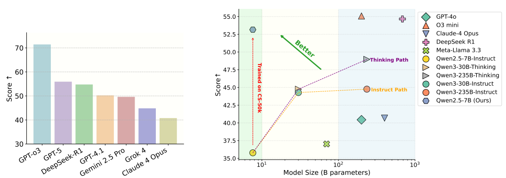
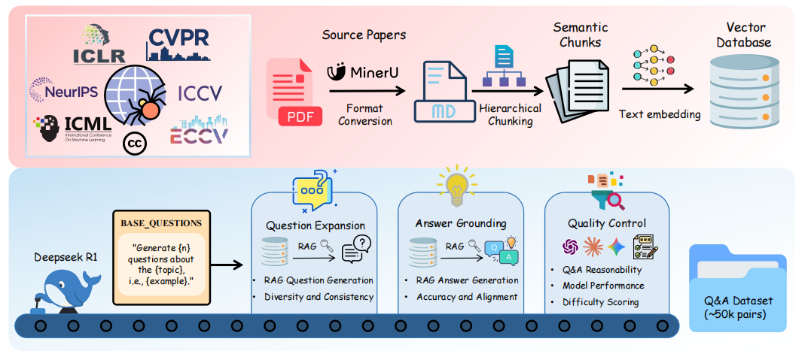
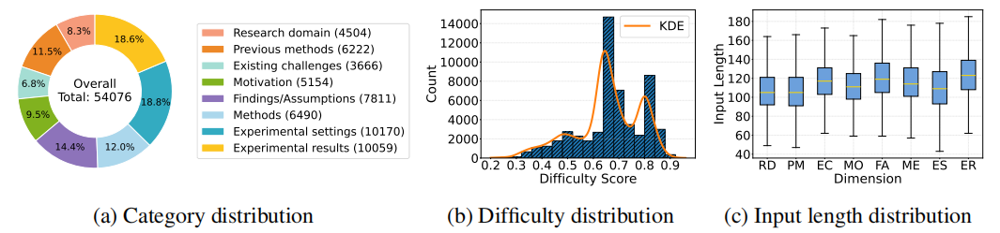
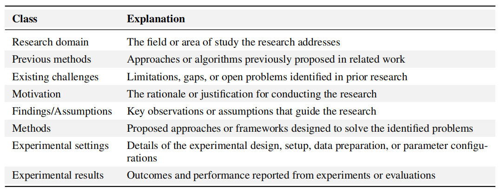

# 🧠 ResearchGPT: Benchmarking and Training LLMs for End-to-End Computer Science Research Workflows

<div align="center">

<a href='https://arxiv.org/abs/2510.20279'></a>
<a href='https://huggingface.co/datasets/wph6/CS-54k'></a>
<a href='LICENSE'></a>
</div>

## ✨ Overview


As large language models (LLMs) advance, the ultimate vision for their role in science is emerging: we could build an AI collaborator to effectively assist human beings throughout the entire scientific research process. We refer to this envisioned system as **ResearchGPT**.
To move toward this goal, we present CS-54k, a high-quality corpus of computer science Q&A pairs derived from 14k CC-licensed papers through a scalable, paper-grounded pipeline combining RAG and multi-stage quality control.

From CS-54k, we derive two subsets:
- **CS-4k**: a benchmark for evaluating end-to-end research-assistant capabilities;
- **CS-50k**: a large-scale training dataset for domain-aligned model development.

Experiments show that even 7B-scale open models fine-tuned on CS-50k surpass larger proprietary systems (e.g., GPT-4.1, GPT-4o, Gemini 2.5 Pro).
This indicates that making AI models better research assistants relies more on domain-aligned training with high-quality data than on pretraining scale or general benchmark performance.


---
## 🧱 Dataset Construction
### Pipeline Overview
A scalable paper-grounded pipeline combining RAG with multi-stage quality control to ensure factual grounding and reproducibility.


---
### Dataset Distributions
Distributions of topic category, difficulty level, and input length across the CS-54k corpus.



### Topic Categories
The dataset organizes each Q&A pair into one of eight topic classes, reflecting distinct reasoning functions within scientific papers:


## ⚙️Training

We fine-tune the Qwen2.5-7B-Instruct model on the CS-50k dataset using **Group Relative Policy Optimization (GRPO)**. The training leverages the [VERL](https://github.com/volcengine/verl) framework for efficient reinforcement learning.


**Run Training:**
```bash
bash scripts/verl/run_qwen2_5-7b_research50k.sh
````

## 📈Evaluation

We evaluate models on **CS-4k**, a high-quality benchmark subset designed to assess end-to-end research-assistant capabilities across eight scientific reasoning categories. The evaluation uses an **LLM-as-a-judge** approach with a detailed 0-10 scoring rubric to measure semantic and technical alignment with reference answers.

**Evaluation Metrics:**
- **Overall Score**: Average score across all CS-4k questions (scaled to 0-100)
- **Category-wise Performance**: Breakdown across eight topic categories:
  - Research domain
  - Previous methods
  - Existing challenges
  - Motivation
  - Findings/Assumptions
  - Methods
  - Experimental settings
  - Experimental results

**Run Evaluation:**
```bash
opencompass scripts/eval/api_gpt5_research4k_llm_judge.py
````

## 🤝 Acknowledgements

This project builds on:

* [**VERL**](https://github.com/volcengine/verl) — A flexible, efficient and production-ready RL training library for large language models (LLMs).  
* [**OpenCompass**](https://github.com/open-compass/opencompass) — A comprehensive open evaluation platform for LLMs.
* [**LLaMA-Factory**](https://github.com/hiyouga/LLaMA-Factory) — An efficient and unified fine-tuning framework for LLMs.


## 📄 License

This project is licensed under the **MIT License**. See the [LICENSE](LICENSE) file for details.

## 📚 Citation
If you find ResearchGPT useful, please cite our paper:
```
@misc{wang2025researchgptbenchmarkingtrainingllms,
      title={ResearchGPT: Benchmarking and Training LLMs for End-to-End Computer Science Research Workflows}, 
      author={Penghao Wang and Yuhao Zhou and Mengxuan Wu and Ziheng Qin and Bangyuan Zhu and Shengbin Huang and Xuanlei Zhao and Panpan Zhang and Xiaojiang Peng and Yuzhang Shang and Jianfei Yang and Zheng Zhu and Tianlong Chen and Zhangyang Wang and Kai Wang},
      year={2025},
      eprint={2510.20279},
      archivePrefix={arXiv},
      primaryClass={cs.LG},
      url={https://arxiv.org/abs/2510.20279}, 
}
```